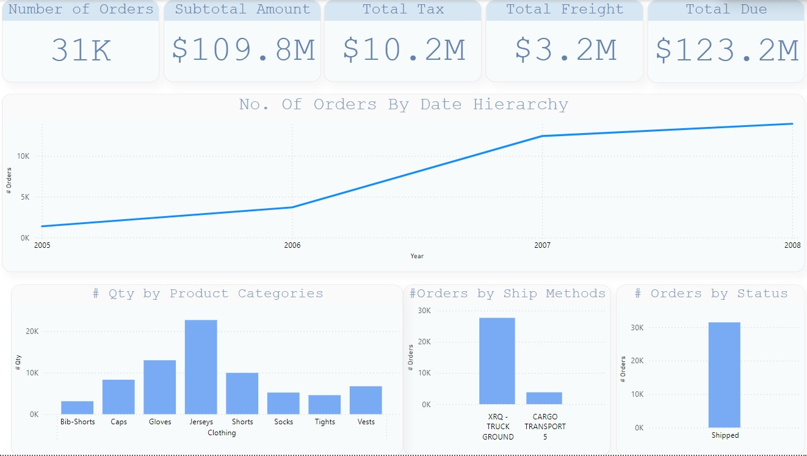
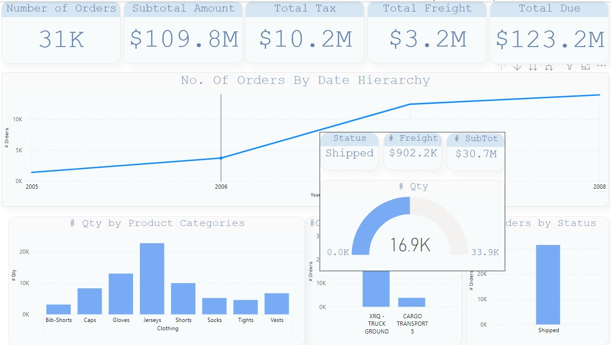
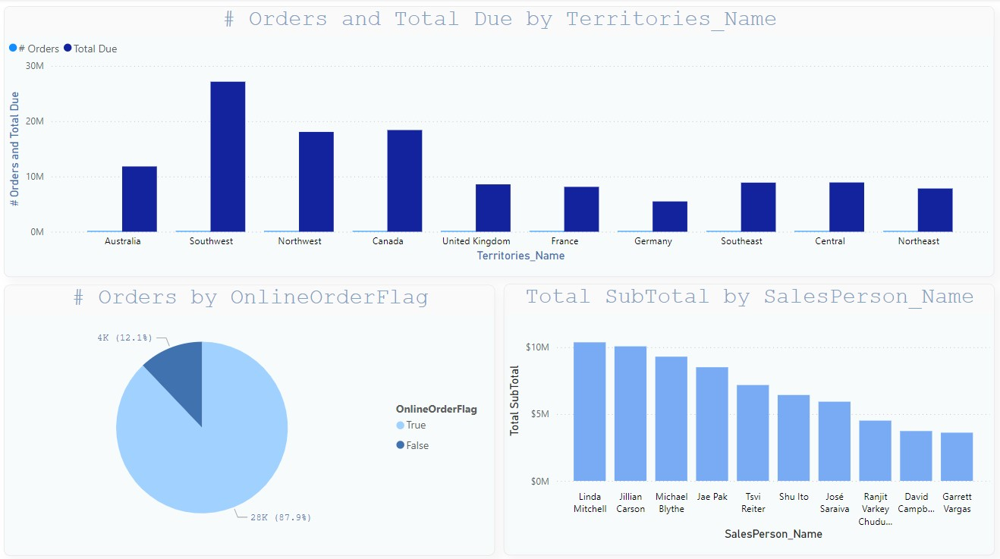

# AdventureWorks-Power-BI-Project

## Overview
This project involves the use of Microsoft Power BI to analyze sales data from the AdventureWorks OLTP database. The project focuses on creating an interactive dashboard using DirectQuery mode, allowing for real-time data analysis. The dashboard includes various measures, visualizations, and features like drill-downs, drill-throughs, and tooltips to provide insights into sales performance.

## Database

**AdventureWorks OLTP**

### Tables Used:
- `Sales.SalesOrderHeader`
- `Sales.SalesOrderDetail`
- `Sales.vSalesPerson` (view)
- `Sales.SalesTerritory`
- `Purchasing.ShipMethod`
- `Production.Product`
- `Production.ProductSubcategory`
- `Production.ProductCategory`

## Modeling

- **Conductivity Mode**: DirectQuery
- **Date Range**: 
  - Start Date: `7/1/2005`
  - End Date: `7/31/2008`
- **Date Table**: Created using DAX

- **Status**: Status values are derived based on the `ufnGetSalesOrderStatusText` function.
- **Renaming**: Tables and columns were renamed for clarity.
- **Unused Columns**: Removed to streamline the model.

## Measures

A set of DAX measures were created to analyze the data:

- **# Orders Measure**: The total number of orders.
- **Total SubTotal Measure**: The total subtotal amount.
- **Total Tax Measure**: The total tax amount.
- **Total Freight Measure**: The total freight amount.
- **Total Due Measure**: The total due amount.
- **# Qty**: The total quantity ordered.

All measures are stored in a dedicated DAX table for easy access.

## Visualizations

The report includes the following visualizations:

- **# Orders Card**: Displaying the total number of orders.
- **Total SubTotal Card**: Showing the total subtotal amount.
- **Total Tax Card**: Displaying the total tax amount.
- **Total Freight Card**: Showing the total freight amount.
- **Total Due Card**: Displaying the total due amount.
- **# Orders by Order Date**: Visualizing the number of orders over time.
- **# Orders by Status**: Displaying orders categorized by their status.
- **# Orders by Shipmethod**: Showing orders based on the shipping method used.
- **# Order Qty by Category, SubCategory, Product**: Visualizing the quantity of orders across categories, subcategories, and products.
- **# Orders by FlagOnlineOffline**: Showing online vs. offline orders.
- **# Orders vs. TotalDue by Territory**: Comparing orders and total due across sales territories.
- **Top 10 Salespersons (Filter Pane)**: Displaying the top 10 salespersons by number of orders or total amount, with a filter pane.

## Features

- **Drill Down**: Allows users to drill down into specific data points.
- **Drill Through**: Provides detailed information by drilling through related data.
- **Tooltip Page**: Custom tooltip pages are used to display additional information on hover.

## Design

The report is designed with good color schemes, a clear layout, and meaningful chart titles to enhance user experience and data interpretation.

## How to Use

1. Clone the repository.
2. Open the Power BI report file (.pbix) in Power BI Desktop.
3. Ensure your environment is configured to connect to the AdventureWorks OLTP database using DirectQuery mode.
4. Explore the various visualizations and insights provided by the dashboard.

## Contributing

Contributions are welcome! Please fork this repository and submit a pull request for any enhancements or bug fixes.

